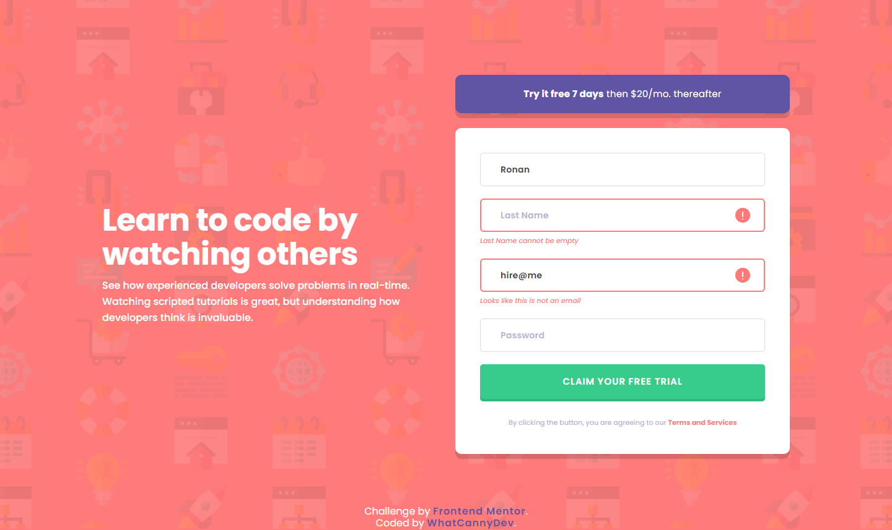

# Frontend Mentor - Intro component with sign up form solution

This is a solution to the [Intro component with sign up form challenge on Frontend Mentor](https://www.frontendmentor.io/challenges/intro-component-with-signup-form-5cf91bd49edda32581d28fd1). Frontend Mentor challenges help you improve your coding skills by building realistic projects. 

## Table of contents

- [Overview](#overview)
  - [The challenge](#the-challenge)
  - [Screenshot](#screenshot)
  - [Links](#links)
- [My process](#my-process)
  - [Built with](#built-with)
  - [What I learned](#what-i-learned)
  - [Continued development](#continued-development)
  - [Useful resources](#useful-resources)
- [Author](#author)

## Overview

### The challenge

Your challenge is to build out this introductory component and get it looking as close to the design as possible.

You can use any tools you like to help you complete the challenge. So if you've got something you'd like to practice, feel free to give it a go.

Users should be able to:

- View the optimal layout for the site depending on their device's screen size
- See hover states for all interactive elements on the page
- Receive an error message when the `form` is submitted if:
  - Any `input` field is empty. The message for this error should say *"[Field Name] cannot be empty"*
  - The email address is not formatted correctly (i.e. a correct email address should have this structure: `name@host.tld`). The message for this error should say *"Looks like this is not an email"*

### Screenshot

### Links

- Solution Repository URL: [Click here](https://github.com/CannyRo/FrontendMentor_IntroComponentWithSignupForm_5cf91bd49edda32581d28fd1)
- Live Site URL: [Click here](https://cannyro.github.io/FrontendMentor_IntroComponentWithSignupForm_5cf91bd49edda32581d28fd1/)

## My process

### Built with

- Semantic HTML5 markup
- CSS custom properties
- Flexbox
- Mobile-first workflow
- Javascript vanilla

### What I learned

I didn't learn anything in particular, but I did get a lot of reminders about DOM manipulation, how to retrieve the value of an input, add or remove a CSS class from an HTML element, retrieve an HTML element, listen to events, etc...
It's a perfect exercise to brush up on some Javascript basics.

### Continued development

Continue to integrate more and more javascript into challenges until ending up using a framework or library.

### Useful resources

- [Map an Object ? Click here](https://developer.mozilla.org/fr/docs/Web/JavaScript/Reference/Global_Objects/Object/entries) - This helped me to remind me how map with Object with loop for... of... + Object.entries()

## Author

- Website - [WhatCannyDev is searching a work-study contract in France](https://cannyro.github.io/hire_mr_canny/en)
- Frontend Mentor - [@CannyRo](https://www.frontendmentor.io/profile/CannyRo)
- GitHub - [@CannyRo](https://github.com/CannyRo)
- LinkedIn - [Ronan CANNY](https://www.linkedin.com/in/ronan-canny-b29443277/)
